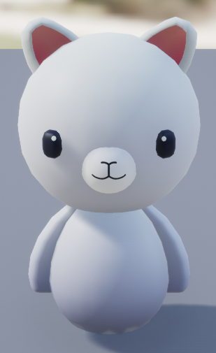
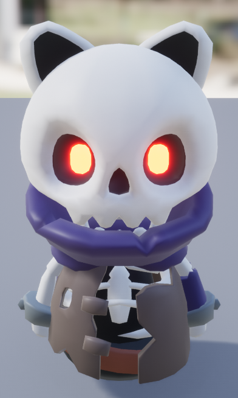
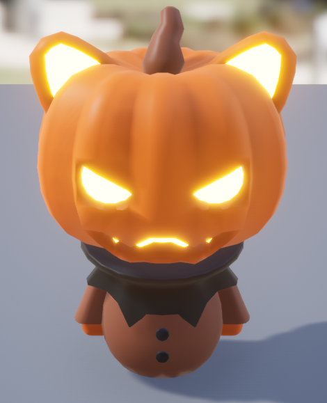

# Hungry Neko

This is a 3D Platformer game made on UnrealEngine 4.27.2 by Remi Serra and Umut Osmanoglu.

# Plot

Once upon a time, a young Cat lived peacefully in the magical kingdom of Nekoland. 
One day, he woke up during the night with a terrible hunger. He wanted a burger and nothing else, so naturally, he decides to go to the closest Burger Queen fast food restaurant. 
However, he realizes that he forgot his wallet, so he has to collect coins along the way to pay for his meal.

# Player

## Controls

- `WASD` : Move the Player
- `Space` : Jump
- `Space on wall` : Wall jump
- `Space in air` : Double Jump 
- `Shift` : Dash
- `Mouse` : Turn the camera around the player

This is Neko, the main character.  

# Enemies

Enemies are manipulated by an AI and we have 2 types of enemies, Skeleton and Jack.

## Skeleton Enemy
    He is a small enemy with cat ears. He has 1 health point, and dies when you jump on his head.
## Jack Enemy
    He is a big enemy with cat ears and with a pumpkin on his head. He has 2 health points, and dies when you jump twice on his head. On the other hand, when you hit his head once, Jack goes back to his spawn and heals himself.
## Ennemy Spawner
    Enemies spawn thanks to an enemy spawner, this enemy spawner can either make a loop or spawn without loop, you can also choose the number of enemies that spawn.

Skeleton and Jack  
 

